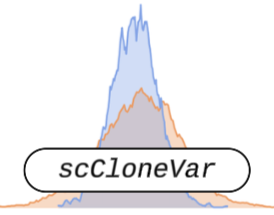

<h1>
  scCloneVar
  
</h1>
Clone-wise heterogeneity and differential expression analysis toolkit for single-cell RNA-seq data.

## Installation

```r
install.packages("devtools")
devtools::install_github("ChrisXC25/scCloneVar")
library(scCloneVar)
```

## Functions Overview

scCloneVar provides an integrated framework for analyzing clonal structure and transcriptional heterogeneity in single-cell RNA-seq data. The toolkit enables clone-wise differential expression analysis, allowing users to compare predefined clone groups across multiple gene universes and statistical models. It quantifies intra- and inter-clonal transcriptional dispersion in PCA space and identifies differential variance genes (DVGs) to capture heterogeneity beyond mean expression changes. The package also supports Output Activity (OA) analysis to classify clones by lineage bias and generate comprehensive visualization reports. Finally, pathway-level interpretation is facilitated through MSigDB-based GSEA, enabling biological contextualization of clone-associated signatures.
