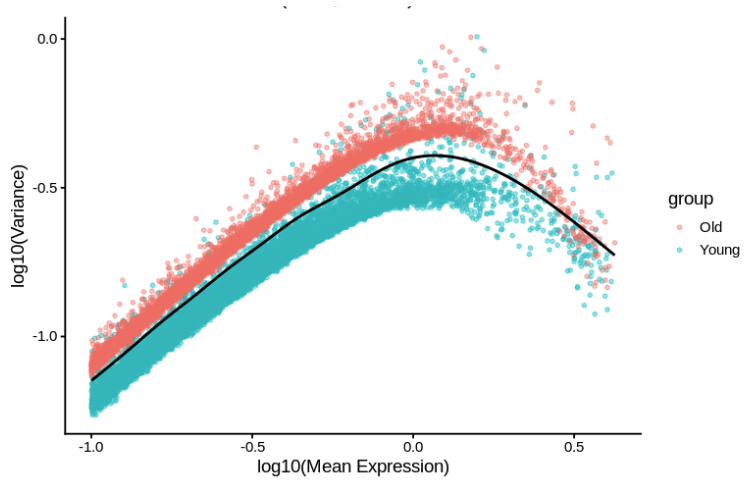
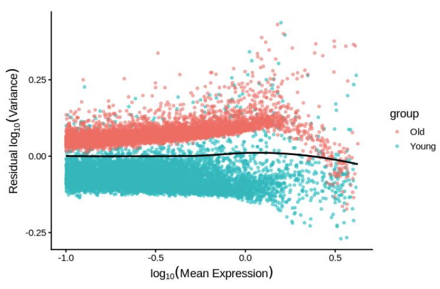

```{r, include = FALSE}
knitr::opts_chunk$set(
  collapse = TRUE,
  comment = "#>",
  warning = FALSE,
  message = FALSE
  #eval = FALSE
)
```


# Overview

<div style="font-size: 16px;">
This vignette demonstrates a complete **scCloneVar workflow** using the included demo dataset (scCloneVar_test_demo).

The analysis proceeds through the following stages:

1. Clone size distribution profiling

2. Output Activity (OA) analysis

3. Clone-wise differential expression

4. Transcriptional heterogeneity analysis (PCA-based distances)

5. Differential variance (DVG) analysis

6. GSEA on ranked heterogeneity statistics
</div>

## Load Package and Demo Data 

```{r}
suppressPackageStartupMessages({library(scCloneVar)
  library(Seurat)})

data(scCloneVar_test_demo)

seurat_obj <- scCloneVar_test_demo
```


```{r}
seurat_obj

```

# Clone Size Distribution

<div style="font-size: 16px;">
This step visualizes clone expansion patterns and computes descriptive statistics across samples.

Clonal expansion is a fundamental property of hematopoietic dynamics, reflecting the proliferative fitness and competitive advantage of individual clones within a sample. Quantifying relative clone size allows comparison across replicates and conditions while controlling for differences in total cell number.


For each replicate, relative clone frequency is defined as:

Relative clone frequency is calculated as  
</div>

<div style="font-size: 20px;">

<br>

$$
\mathrm{RelFreq} =
\frac{\text{cells in clone}}{\text{total cells in replicate}}
$$

<br>

</div>

<div style="font-size: 16px;">
Clones below a user-defined frequency threshold are grouped as Other, enabling clearer visualization of dominant expansions.
</div>

```{r,fig.width=4, fig.height=2.5, out.width="70%", dpi=300}
comparison_list <- list(
  list(seurat_obj = seurat_obj,samples = grep("^Y_vitro", unique(seurat_obj$sampleName), value = TRUE),label_counts = data.frame(
      Sample = grep("^Y_vitro", unique(seurat_obj$sampleName), value = TRUE),
      Replicate = unique(seurat_obj$Rep[grepl("^Y_vitro", seurat_obj$sampleName)]),
      SampleLabel = grep("^Y_vitro", unique(seurat_obj$sampleName), value = TRUE)),
    threshold = 0.05,
    title = "Relative Clone Size Distribution: Y_vitro",
    name = "Y_vitro"),
  list(
    seurat_obj = seurat_obj,
    samples = grep("^O_vitro", unique(seurat_obj$sampleName), value = TRUE),
    label_counts = data.frame(
      Sample = grep("^O_vitro", unique(seurat_obj$sampleName), value = TRUE),
      Replicate = unique(seurat_obj$Rep[grepl("^O_vitro", seurat_obj$sampleName)]),
      SampleLabel = grep("^O_vitro", unique(seurat_obj$sampleName), value = TRUE)),
    threshold = 0.05,
    title = "Relative Clone Size Distribution: O_vitro",
    name = "O_vitro"))

dist_out <- run_clone_distribution_engine(comparison_list)

dist_out$plots$Y_vitro
dist_out$plots$O_vitro
```
<div style="font-size: 16px;">
Relative clonal size summary table is also provided:
</div>
```{r}
dist_out$descriptive_stats$Y_vitro
```

# Output Activity (OA) Analysis

<div style="font-size: 16px;">
This step quantifies clone-level output bias and classifies clones into low and high output groups.

Output Activity (OA) measures the differentiation bias of each clone by comparing its contribution to non-HSC versus HSC compartments. Following the conceptual framework described by Singh et al., Cell Stem Cell (2025) https://www.cell.com/cell-stem-cell/fulltext/S1934-5909(25)00012-8, OA reflects the functional output potential of a clone — that is, whether a clone preferentially produces differentiated progeny or remains stem-biased. In this implementation, OA is computed as the relative enrichment of non-HSC output normalized to HSC contribution within each clone.
</div>

For a given clone $c$, Output Activity is defined as:

$$
\mathrm{OA}_c = 
\frac{\mathrm{nonHSC\_freq}_c + \epsilon}
     {\mathrm{HSC\_freq}_c + \epsilon}
$$

where

$$
\mathrm{HSC\_freq}_c = 
\frac{N^{\mathrm{HSC}}_c}
     {N^{\mathrm{HSC}}_c + N^{\mathrm{nonHSC}}_c}
$$

$$
\mathrm{nonHSC\_freq}_c = 
\frac{N^{\mathrm{nonHSC}}_c}
     {N^{\mathrm{HSC}}_c + N^{\mathrm{nonHSC}}_c}
$$

and

$$
\epsilon = 10^{-6}
$$

<div style="font-size: 16px;">
Higher OA values indicate clones with greater differentiation output potential, whereas lower OA values represent stem-biased clones.
</div>

## Required Inputs

<div style="font-size: 16px;">
The function requires a Seurat object containing:
- A UMAP reduction named "umap",
- Metadata columns specifying celltype and clone identity (default "CloneID"),
- Defined HSC cell types (default: LT-HSC, ST-HSC).
- Optional arguments allow specification of non-HSC cell types, DEG cell subsets, reference marker lists, color mappings, and statistical thresholds.
</div>

```{r}
# Define low and high output marker 

low_output_markers <- c(
  "Mpl","Ifitm3","Ifitm1","Tgm2","H2-K1","Socs2","Mycn","Nupr1","Hacd4",
  "Mllt3","Gda","B2m","Procr","Txnip","Clu","Sult1a1","S100a6","Rpl36a",
  "Tsc22d1","Gng11","Ccnd2","mt-Co3","Tmem176b","Lmo2","Ly6a","Mmrn1",
  "Trim47","St3gal1","Mecom","Pik3r1","Adgrg1","Esam","Ryk","Rps21","Hoxb8",
  "Ccnd1","Uba7","Rps28","Serpina3g","Rpl37a","Fkbp1a","Pdzk1ip1","Selp",
  "Eif4a2","Tmem176a","Bex4","Grb10","Jam3","Ptk2b","Gimap8","Csgalnact1",
  "H2-Q7","App","Mylk","Casp12","Rhof","Laptm4a","Tcf15","Gabarapl1","Ctsl",
  "Bex1","Rpl21","D630039A03Rik","Myof","Glul","Ppic","Tpt1","Rpl5","Cdkn1c",
  "mt-Nd5","Abcg3","Aplp2","Art4","Tbxas1","Cish","Vwf","Scarf1","mt-Atp6",
  "H2-Eb1","H2-D1","Cd74","Iigp1","Aldh1a1","Gstm1","mt-Nd4","mt-Cytb","mt-Co1"
)
high_output_markers <- c(
  "Plac8","H2afy","Cdk6","Cd34","Nkg7","Ptma","Mpo","Cd48","Stmn1","Fam117a",
  "Slc22a3","Adgrg3","Ppia","Car1","Ctsg","Flt3","Lgals1","Muc4","Gpx1",
  "Hmgb2","Ndufa4","Serpinb1a","Ccl9","Oaz1","H2afz","Crip1","Mcm7","Cpa3",
  "Vim","Ybx1","Sell","Sh3bgrl3","H3f3a","Dut","Atpif1","Ran","Hnrnpa2b1",
  "Hdgf","Mcm4","Elane","Rabgap1l","Cmtm7","Rpsa","Mcm6","Plek","Set","Atp5g3",
  "Myc","Taldo1","Tuba1b","Cks2","Slc25a5","Fam65a","Cebpa","Tmsb10","Cd52",
  "Klf1","Anp32b","Hn1","Parvg","Ffar2","Bex6","Emilin2","Itgal","Cox5a",
  "Hnrnpab","Ighm","BC035044","Lmnb1","Golm1","Bin1","Igfbp4","Tyrobp","E2f8",
  "Banf1","Cst7","Sh2d5","Aqp1","Ptbp3","Snrpf","Rfc2","Ramp1","Hmgn5","Nme1"
)
# Can be set to NULL if no comparison needed, for simplicity we show a few genes here
ref_deg_genes_list <- c("Olfm3","Scin","Tox","Pbx3","Mecom","Fry","Slc24a3","Pcdh7" )

```


```{r, warning=FALSE}
## Define celltype colors manually ##
celltype_colors <- c(
  ## HSCs 
  "LT-HSC" = "#E76F51",
  "ST-HSC" = "#F4A261",
  ## Early progenitors 
  "MPP"  = "#5BC374",
  "MPP3" = "#4CAF50",
  "MPP4" = "#66CDAA",
  "CMP"  = "#C49A6C",
  "EryP" = "#F28E2B",
  "LMPP" = "#4DB6AC",
  ## Myeloid differentiation
  "GMP"   = "#1FA187",
  "GMP-3" = "#2BBBAD",
  "MDP"   = "#7C9A3D",
  "Granulocyte" = "#6C8EBF",
  ## Megakaryocyte / Platelet
  "MkP"   = "#5FBAC8",
  "MKP"   = "#4DA8B5",
  "MKP-1" = "#78C2D0",
  ## Erythroid / Megakaryocyte
  "MEP"     = "#8C973E",
  "MEP-1"   = "#7A8735",
  "MEP-2"   = "#9AAE4C",
  "MEP/EryP"= "#A4B95A",
  ## Mast / Basophil 
  "Ba/mast"   = "#C77DFF",
  "Mast-cell" = "#B565D9",
  ## Immune / Other 
  "DC"  = "#9E6E4A",
  "Mac" = "#7F5539",
  "Mast-Cells" = "#D98BB8",
  ## T cell 
  "T-cells" = "#6CA3D1",
  "T-cell"  = "#4F8AC9",
  "T-Cell"  = "#83B8E6",
  ## Undefined
  "UN" = "grey65")

## Run OA function ##

oa_out <- run_low_high_OA_analysis_for_a_single_sample(seurat_obj = seurat_obj,
  sample_label = "DemoSample",celltype_colors = celltype_colors,low_output_markers = low_output_markers,
  high_output_markers = high_output_markers, full_ref_deg_genes_list = ref_deg_genes_list,
  umap_reduction = 'umap')

```

## Expected Outputs

<div style="font-size: 16px;">
The function returns a structured results object (also saved to disk) containing:
- Per-clone OA values and low/high classifications
- Cell-level OA annotations
</div>

```{r}
head(oa_out$OA_by_clone) # Clone-level OA values 
head(oa_out$OA_by_cell)  # Cell-level OA values 
```
<div style="font-size: 16px;">
-Clone-wise DEG results (via run_clonewise_DEG_suite())
</div>

```{r,fig.width=6, fig.height=3.5, out.width="80%", dpi=300}

oa_out$DEG_results$volcano_plot

```
<div style="font-size: 16px;">
-UMAP visualizations (cell type, OA gradient, contour)
</div>

```{r,fig.width=6, fig.height=3.5, out.width="80%", dpi=300}

oa_out$plot_dim

```

<div style="font-size: 16px;">
-Universe-restricted enrichment tests
</div>

```{r,fig.width=6.5, fig.height=4, out.width="80%", dpi=300}

oa_out$plot_venn_filtered

```
<div style="font-size: 16px;">
Density across celltypes 
</div>

```{r,fig.width=6, fig.height=3.5, out.width="80%", dpi=300}

oa_out$plot_contour

```
<div style="font-size: 16px;">
-A complete RDS object consolidating tables and plots.
</div>


# Clone-wise Differential Expression

<div style="font-size: 16px;">
Differential expression analysis between low and high OA clones.

We next perform clone-wise differential expression analysis by directly comparing cells derived from low-output (stem-biased) versus high-output (differentiation-biased) clones. This design tests whether transcriptional programs differ as a function of clonal output activity and linking functional clone behavior to gene expression changes.
</div>

```{r,warning=FALSE}

deg_out <- run_clonewise_DEG_suite(
  seurat_obj = seurat_obj, clone_set1_ids = oa_out$low_clones, clone_set2_ids = oa_out$high_clones,
  clone_col = "CloneID", assay_name  = "RNA", top_hvgs  = 2000, min_detect_prop = 0.10,
  min_mean_norm = 0.10, min_mean_raw = 2, fc_cutoff  = 0.25, fdr_cutoff = 0.05,)

```

### Volcano Plots (clone-wise DEGs)
```{r, fig.width=6.5, fig.height=4, out.width="80%", dpi=300}

deg_out$volcano_plot

```

# PCA-Based Clone Heterogeneity

<div style="font-size: 16px;">
Quantifies intra- and inter-clonal transcriptional distances in PCA space.

Intra-clonal distance 

We first embed all cells into PCA space (top n PCs). For each clone, we compute its clone centroid as the mean PC coordinate vector across cells in that clone, then quantify intra-clonal heterogeneity as the average Euclidean distance from each cell to its own clone centroid (i.e., within-clone dispersion).

Inter-clonal distance

To quantify inter-clonal heterogeneity, we compute (for each clone A) the average Euclidean distance from cells in clone A to the centroid of every other clone B, and then take the mean across B to obtain a per-clone mean inter-clone distance (i.e., how far a clone sits from other clones in transcriptional PC space).
</div>
```{r,eval=TRUE}

het_out <- compute_pca_clone_heterogeneity(
    seu = seurat_obj,celltype_keep = c("LT-HSC", "ST-HSC"),
    clone_col = "CloneID", sample_col = "sampleName", assay = "RNA",
    n_pcs = 30, min_pct = 0.1, min_mean = 0.1, min_cells = 2, group_recode = NULL,
    sample_order = c("Y_vitro", "O_vitro"), prefix = "Clone Heterogeneity")

```
<div style="font-size: 16px;">
Summary table for intra and inter-clonal PCA distance
</div>
```{r}

head(het_out$summary)

```

<div style="font-size: 16px;">
Within and between group statistical test
</div>

```{r}

print(het_out$within_group_tests)
print(het_out$between_group_tests)

```

<div style="font-size: 16px;">
Intra and inter-clonal PCA distance violin plot
</div>

```{r,fig.width=7, fig.height=5, out.width="70%", dpi=300}

het_out$plot

```

# Differential Variance and CV Analysis

<div style="font-size: 16px;">
Identifies Differential Variance Genes (DVGs) across groups.

Beyond clone-level heterogeneity, it is often informative to examine transcriptional heterogeneity at the gene level. Variability analysis can reveal regulatory instability, transcriptional noise, or lineage priming effects that are not detectable through mean expression analysis alone.

To quantify transcriptional heterogeneity, the function compute_variance_and_cv() identifies Differential Variability Genes (DVGs) between two biological groups. This function performs several complementary analyses:

- Variance difference tests

- Mean-adjusted variance estimation

- Coefficient of variation (CV) comparison

The workflow implemented here follows the statistical framework described by Eling et al. (2018) (https://www.cell.com/cell-systems/fulltext/S2405-4712(18)30278-3?_returnURL=https%3A%2F%2Flinkinghub.elsevier.com%2Fretrieve%2Fpii%2FS2405471218302783%3Fshowall%3Dtrue), which accounts for the dependency between gene expression mean and variance. This is critical because highly expressed genes naturally tend to exhibit larger variance.

For each gene, we first test whether expression variance differs between groups using three classical tests:
</div>

## Brown–Forsythe Test

<div style="font-size: 16px;">
The Brown–Forsythe test evaluates whether variance differs between groups by computing deviations from the **group median**.

Group median:

$$
\tilde{x}_j = \text{median}(x_{1j}, x_{2j}, \ldots, x_{n_j j})
$$
Absolute deviations from the group median:

$$
z_{ij} = |x_{ij} - \tilde{x}_j|
$$

The ANOVA test statistic is:

$$
F =
\frac{
(N-k)\sum_{j=1}^{k} n_j (\bar{z}_j - \bar{z})^2
}{
(k-1)\sum_{j=1}^{k}\sum_{i=1}^{n_j}(z_{ij}-\bar{z}_j)^2
}
$$

where

$$
\bar{z}_j =
\frac{1}{n_j}\sum_{i=1}^{n_j} z_{ij}
$$

$$
\bar{z} =
\frac{1}{N}\sum_{j=1}^{k}\sum_{i=1}^{n_j} z_{ij}
$$

Before mean-adjusted variance correction:
</div>
```{r,fig.align="center", out.width="70%"}



```
<div style="font-size: 16px;">
After mean-adjusted variance correction:
</div>
```{r,fig.align="center", out.width="70%"}



```

<div style="font-size: 16px;">
Technical or unrelated genes could add noise to the variance analysis, therefore we will filter out mitochondrial, ribosomal genes before we compute the per-gene variance
</div>

```{r,warning=FALSE}
all_genes <- rownames(seurat_obj)
# For Mouse 
genes_filtered <- all_genes[!grepl("^mt-", all_genes, ignore.case = TRUE) &
  !grepl("^Rps", all_genes) & !grepl("^Rpl", all_genes) &
  !grepl("^Hist", all_genes) &!grepl("^Gm[0-9]", all_genes) &
  !grepl("Rik$", all_genes)]

# For Human
#genes_filtered <- all_genes[!grepl("^MT-", all_genes, ignore.case = TRUE) &
#  !grepl("^RPS", all_genes) & !grepl("^RPL", all_genes) &
#  !grepl("^HIST", all_genes) & !grepl("^GM[0-9]", all_genes) &
#  !grepl("RIK$", all_genes)]

seurat_clean <- subset(seurat_obj, features = genes_filtered)

```

<div style="font-size: 16px;">
compute_variance_and_cv() returns a per-gene heterogeneity assessment table
Here we will be using the top 2000 high variable genes identified from seurat and perform all 3 tests (brown_forsythe, levene and bartlett) 
</div>

```{r,eval=TRUE,warning=FALSE}

dvg_out <- compute_variance_and_cv(
  seu = seurat_obj, slot = "data", group_col = "donor_age", n_hvg = 2000,
  selection.method = "vst", n_cores = 1, chunk_size = 250, tests = c("brown_forsythe", "levene", "bartlett"),
  min_pct = 0.1, min_mean = 0.1)

```

<div style="font-size: 16px;">
Check the output tables
</div>

```{r}

head(dvg_out)

```

# Visualization of Heterogeneity Patterns

<div style="font-size: 16px;">
After computing differential variability statistics using compute_variance_and_cv(), the function plot_variance_cv_summaries() provides a comprehensive visualization suite for exploring heterogeneity patterns across biological groups.
</div>

```{r,eval=TRUE,warning=FALSE}

dvg_plots <- plot_variance_cv_summaries(dvg_out)

```

<div style="font-size: 16px;">
First it returns a global summary table showing the difference of global transcriptional heterogeneity between the two groups (eg: Young vs Old (g1 and g2 are based on the factor level of the group_col = "donor_age"))
</div>

```{r}
dvg_plots$summary_counts
```

<div style="font-size: 16px;">
Boxplot for mean-adjusted variance 
</div>

```{r,fig.align="center",fig.width=6, fig.height=4, out.width="80%", dpi=300}

dvg_plots$mean_adj_var_box

```

<div style="font-size: 16px;">
Global density plot showing the distribution of the variance between the two groups
</div>

```{r,fig.align="center",fig.width=6, fig.height=4, out.width="80%", dpi=300}

dvg_plots$density_mean_adj

```

<div style="font-size: 16px;">
Volcano plot for differential variable genes (DVGs) 
</div>

```{r,fig.align="center",fig.width=6, fig.height=4, out.width="80%", dpi=300}

dvg_plots$volcano_mean_adj

```

# Visualization of per-gene normalized experssion and heterogeneity

<div style="font-size: 16px;">
We can also visualized the expression pattern and the variance of the individual gene from the comparison groups using function plot_density_gene(), showing Eya1 as an example below:
</div>

```{r}
table(seurat_obj$donor_age)
```

```{r,fig.align="center",fig.width=6, fig.height=4, out.width="80%", dpi=300}

plot_density_gene(
    seurat_obj = seurat_obj,
    gene = "Eya1",
    group_col = "donor_age",
    group1_labels = c("Y", "Young"),
    group2_labels = c("O", "Old"),
    group1_name = "Young",
    group2_name = "Old",
    title_prefix = "Day60 HSC",
    dvgs_df = dvg_out,
    mean_adj_var_group1_col = "mean_adjusted_var_Young",
    mean_adj_var_group2_col = "mean_adjusted_var_Old"
)

```

# GSEA Across MSigDB Collections

<div style="font-size: 16px;">
Performs enrichment analysis on ranked heterogeneity statistics.

Differential variability analysis identifies genes whose expression variability differs between biological conditions. However, gene-level results can be difficult to interpret biologically.

To address this, we perform Gene Set Enrichment Analysis (GSEA) using the ranked heterogeneity statistics to identify pathways whose genes collectively show increased or decreased transcriptional variability.

The function run_msigdb_gsea_all_collections() performs GSEA across multiple MSigDB gene set collections, enabling pathway-level interpretation of transcriptional heterogeneity changes.
</div>


## Method Overview

<div style="font-size: 16px;">
The workflow proceeds as follows:

Rank genes by heterogeneity statistic

Genes are ranked using a selected variable from the DVG results, typically:

log2 fold change of mean-adjusted variance

mean-adjusted variance score

other heterogeneity metrics

Example ranking variable:
```{r, eval=FALSE}
log2FC_mean_adjusted_variance
```
Map gene symbols to ENTREZ IDs

MSigDB gene sets are defined using ENTREZ identifiers, so gene symbols are converted before enrichment analysis. MsigDB Collections listed below: H, C2, C3, C4, C5, C6, C7, C8 

Construct ranked gene list

A ranked vector is constructed:

$$
geneList = {g_1, g_2, ..., g_n}
$$
sorted by the heterogeneity statistic.

Higher-ranked genes correspond to greater variability increases in the comparison group.

```{r,results='hide', eval=TRUE ,warning=FALSE, message=FALSE}

gsea_out <- run_msigdb_gsea_all_collections(
  hsc_results = dvg_out,species = "Mus musculus",
  rank_var = "log2FC_mean_adjusted_variance", top_n = 1,
  title_prefix = "HSC")

```
</div>


## Visualize the GSEA results 

<div style="font-size: 16px;">
The function returns a patchwork style of GSEA plots based on the top_n parameter. 
</div>

```{r,fig.align="center",fig.width=6, fig.height=4, out.width="80%", dpi=300}

gsea_out$per_collection$`C5:MF`$panel_up

```
